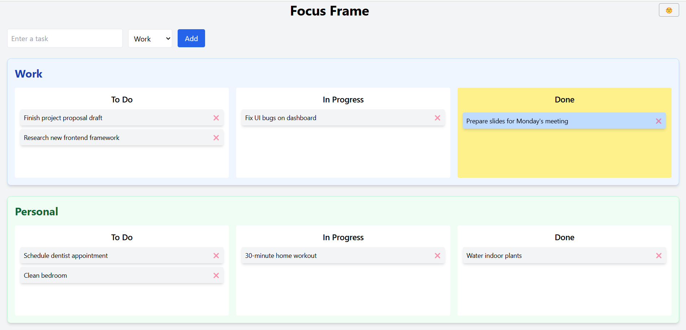
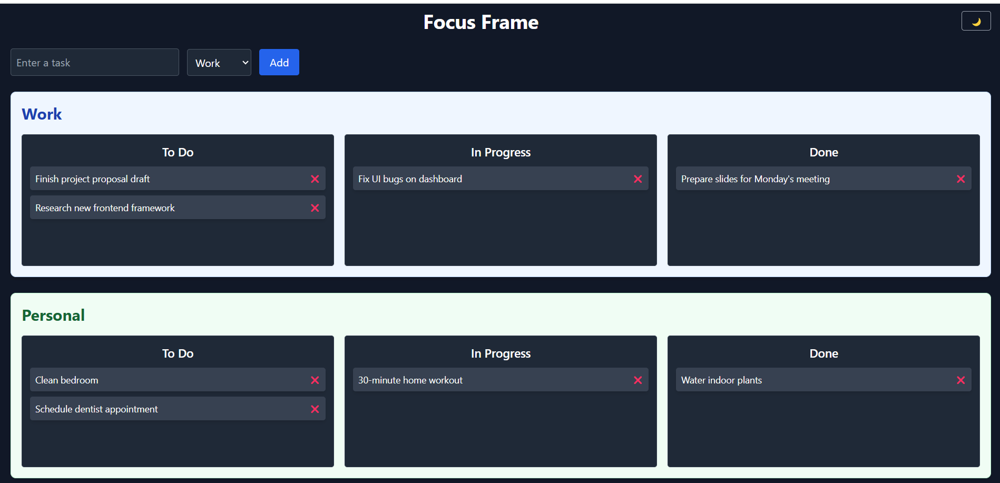

# Getting Started with Create React App

This project was bootstrapped with [Create React App](https://github.com/facebook/create-react-app).

## Available Scripts

In the project directory, you can run:

### `npm start`

Runs the app in the development mode.\
Open [http://localhost:3000](http://localhost:3000) to view it in your browser.

The page will reload when you make changes.\
You may also see any lint errors in the console.
# 📝 To-Do Dashboard

A visually polished and interactive To-Do list app built with **React**, **Tailwind CSS**, and **react-beautiful-dnd**. Manage tasks across **Work** and **Personal** sections, each having three columns: **To Do**, **In Progress**, and **Done**. Supports drag-and-drop, dark mode, and task deletion.

## 🚀 Features

- 🧩 Drag-and-drop between columns and sections
- 🌗 Dark/Light theme toggle
- 🗂️ Separate sections for Work and Personal tasks
- ✅ Task states: To Do, In Progress, Done
- 🗑️ Task deletion
- 🎨 Stylish UI with Tailwind CSS

## 📸 Screenshot

![Screenshot]


## 🛠️ Tech Stack

- React
- Tailwind CSS
- react-beautiful-dnd

## 📦 Installation

1. Clone the repo:

```bash
git clone https://github.com/hindu17/To-Do-dashboard-with-drag-and-drop
cd todo-dashboard

"# To-Do-dashboard-with-drag-and-drop" 
